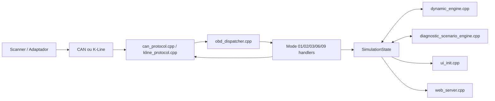

# 06 - Arquitetura de Firmware

## Stack usada

| Item | Escolha atual |
|---|---|
| MCU | `ESP32` |
| Framework | `Arduino-ESP32` sobre FreeRTOS |
| Build | `PlatformIO` |
| Linguagem | `C++` |
| Persistencia | `Preferences / NVS` |
| Filesystem | `LittleFS` |
| Web | `ESPAsyncWebServer` + `AsyncWebSocket` |

## Estrutura real do firmware

```text
firmware/
|- include/
|  |- alert_types.h
|  |- config.h
|  |- diagnostic_scenarios.h
|  |- diagnostic_scenario_engine.h
|  |- dynamic_engine.h
|  |- fault_catalog.h
|  |- obd_types.h
|  |- simulation_state.h
|  `- vehicle_profiles.h
`- src/
   |- main.cpp
   |- obd/
   |  |- mode01_handler.*
   |  |- mode02_handler.*
   |  |- mode03_handler.*
   |  |- mode06_handler.*
   |  |- mode09_handler.*
   |  `- obd_dispatcher.*
   |- protocols/
   |  |- can_protocol.*
   |  |- kline_protocol.*
   |  `- protocol_init.cpp
   |- simulation/
   |  |- alert_engine.cpp
   |  |- diagnostic_scenario_engine.cpp
   |  |- dynamic_engine.cpp
   |  `- fault_catalog.cpp
   `- web/
      |- ui_init.cpp
      `- web_server.*
```

## Blocos funcionais

### 1. Boot e orquestracao

Arquivo principal:

- `firmware/src/main.cpp`

Responsabilidades:

- iniciar `Serial`
- carregar o protocolo salvo em NVS
- usar o DIP como fallback
- preparar LEDs de status
- subir protocolo, UI, web e motor dinamico

### 2. Transporte OBD

Arquivos:

- `firmware/src/protocols/protocol_init.cpp`
- `firmware/src/protocols/can_protocol.cpp`
- `firmware/src/protocols/kline_protocol.cpp`

Responsabilidades:

- manter os workers de CAN e K-Line ativos
- ligar ou deixar o hardware inerte conforme `active_protocol`
- encapsular e desencapsular mensagens OBD
- tratar init de `ISO 9141-2`, `KWP 5-baud` e `KWP Fast`

### 3. Core OBD

Arquivos:

- `firmware/src/obd/obd_dispatcher.cpp`
- `firmware/src/obd/mode01_handler.cpp`
- `firmware/src/obd/mode02_handler.cpp`
- `firmware/src/obd/mode03_handler.cpp`
- `firmware/src/obd/mode06_handler.cpp`
- `firmware/src/obd/mode09_handler.cpp`

Responsabilidades:

- receber `OBDRequest`
- rotear por `mode`
- montar `OBDResponse`
- gerar respostas negativas quando necessario

### 4. Estado e simulacao

Arquivos:

- `firmware/include/simulation_state.h`
- `firmware/src/simulation/dynamic_engine.cpp`
- `firmware/src/simulation/diagnostic_scenario_engine.cpp`
- `firmware/src/simulation/alert_engine.cpp`
- `firmware/src/simulation/fault_catalog.cpp`

Responsabilidades:

- manter o estado compartilhado do veiculo
- atualizar dinamica de motor, velocidade, carga e temperaturas
- persistir odometro
- injetar falhas e cenarios diagnosticos
- construir alertas e freeze frames

### 5. UI local e web

Arquivos:

- `firmware/src/web/ui_init.cpp`
- `firmware/src/web/web_server.cpp`

Responsabilidades:

- OLED SH1107
- botoes e encoder
- Web UI, API REST, WebSocket e OTA
- persistencia de configuracao web e protocolo

## Fluxo de dados



## Estado compartilhado

`SimulationState` concentra:

- parametros do powertrain
- lista efetiva e manual de DTCs
- VIN
- protocolo ativo
- perfil de veiculo
- modo de simulacao
- campos da camada diagnostica
- odometro e distancias de servico

Campos principais:

- `rpm`
- `speed_kmh`
- `coolant_temp_c`
- `intake_temp_c`
- `maf_gs`
- `map_kpa`
- `throttle_pct`
- `engine_load_pct`
- `battery_voltage`
- `stft_pct`
- `ltft_pct`
- `dtcs[]`
- `vin`
- `active_protocol`

## Selecao de protocolo

### Fonte da verdade

1. NVS (`Preferences`, chave `proto`)
2. DIP switch como fallback

### Fluxo atual

- UI local altera `active_protocol`
- web/API altera `active_protocol`
- `web_server.cpp` persiste o valor em NVS
- no proximo boot, `main.cpp` restaura esse protocolo

## K-Line internamente

`kline_protocol.cpp` hoje faz:

- espera por `5 baud init` ou `fast init`
- arma sessao ativa
- expira sessao por inatividade
- volta ao estado de espera quando necessario
- monta frames ISO ou KWP conforme o protocolo ativo

Essa separacao foi importante para fazer o simulador conversar com `OBDLink`, `Torque Pro` e `YouAutoCar`.

## Dynamic engine

`dynamic_engine.cpp` faz:

- presets de motor parado, marcha lenta, cruzeiro, carga total e sobreaquecimento
- dinamica continua de velocidade e RPM
- MAF, MAP, TPS, combustivel, oleo e tensao
- persistencia do odometro total via NVS

## Camada diagnostica

`diagnostic_scenario_engine.cpp` faz:

- cenarios compostos
- geracao de falhas efetivas
- MIL / limp mode
- freeze frame ativo
- historico `freeze_frames[]`
- rebuild de DTCs apos limpeza ou troca de cenario

## UI local

`ui_init.cpp` faz:

- splash de boot
- navegacao do OLED
- leitura de botoes e encoder
- mudanca rapida de protocolo

Estado atual do splash:

- `BOOT_SPLASH_MS = 6000`

## Web server

`web_server.cpp` faz:

- status geral e API REST
- WebSocket
- pagina principal
- OTA online por manifest
- persistencia de hostname, credenciais e protocolo

## Observacao importante para manutencao

Os arquivos antigos citados em documentacao historica, como `iso9141.cpp`, `kwp2000.cpp` ou `display.cpp`, nao representam mais a estrutura atual. O firmware foi consolidado principalmente em:

- `kline_protocol.cpp`
- `can_protocol.cpp`
- `ui_init.cpp`
- `web_server.cpp`
