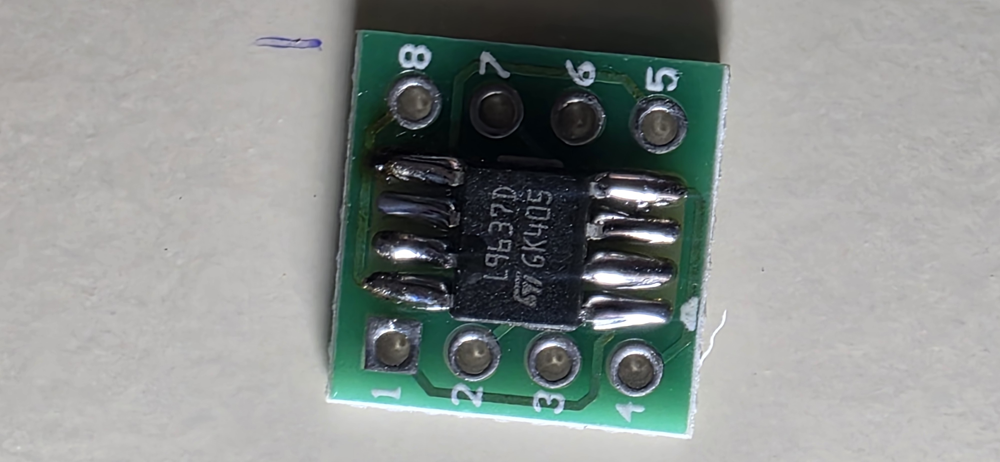
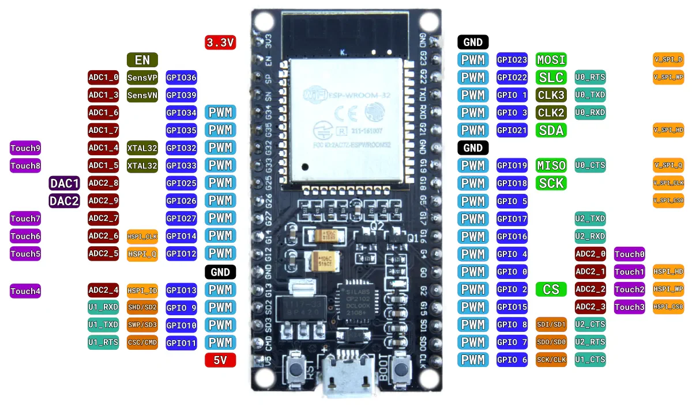
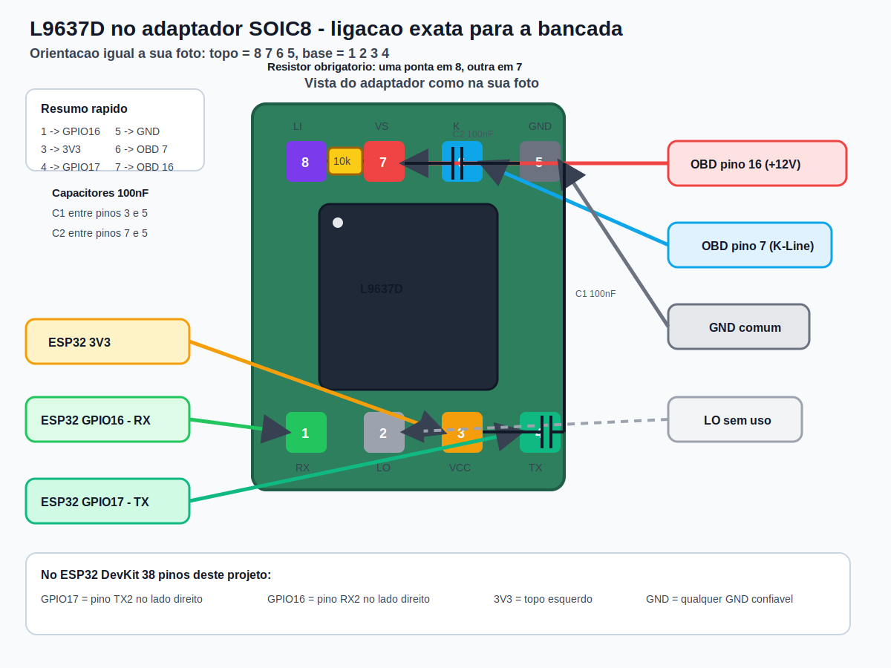

# 13 - Montagem K-Line com L9637D

## Objetivo

Descrever a montagem completa da interface `K-Line` do `YouSimuladorOBD` usando:

- `ESP32`
- `L9637D` em encapsulamento `SOIC8`
- adaptador `SOIC8 -> DIP8`
- conector `OBD-II`

Esta montagem substitui a ideia inicial com transistor discreto e passa a ser a referencia preferida para a bancada e para a versao final do simulador.

## Componentes

- `1x L9637D`
- `1x adaptador SOIC8 -> DIP8`
- `1x resistor 10k`
- `1x capacitor 100 nF` entre `VCC` e `GND`
- `1x capacitor 100 nF` entre `VS` e `GND`
- fios para `GPIO16`, `GPIO17`, `3V3`, `GND`, `OBD pino 7`, `OBD pino 16`, `OBD pinos 4/5`

## Referencias visuais da bancada

Foto real do seu adaptador ja soldado:



Pinout do ESP32 DevKit 38 pinos usado no projeto:



Esquema vetorial desta mesma ligacao:



## Pinagem do L9637D

Top view do CI:

```text
           ┌─────────────┐
RX      1  │•           8│  LI
LO      2  │            7│  VS
VCC     3  │   L9637D   6│  K
TX      4  │            5│  GND
           └─────────────┘
```

Funcoes:

- `RX`: saida logica do barramento K para o microcontrolador
- `LO`: saida logica do comparador da linha L
- `VCC`: alimentacao logica do CI
- `TX`: entrada logica do microcontrolador para dirigir a linha K
- `GND`: terra comum
- `K`: linha K automotiva
- `VS`: alimentacao automotiva
- `LI`: entrada do comparador da linha L

## Mapa de ligacao no projeto

| Pino L9637D | Nome | Liga em | Observacao |
|---|---|---|---|
| `1` | `RX` | `GPIO16` do ESP32 | `PIN_KLINE_RX` no firmware |
| `2` | `LO` | `NC` | deixar sem uso nesta primeira versao |
| `3` | `VCC` | `3V3` do ESP32 | logica do CI |
| `4` | `TX` | `GPIO17` do ESP32 | `PIN_KLINE_TX` no firmware |
| `5` | `GND` | `GND` comum | mesmo GND do ESP32 e do OBD |
| `6` | `K` | OBD pino `7` | barramento K-Line |
| `7` | `VS` | OBD pino `16` | `+12V` automotivo |
| `8` | `LI` | `VS` por resistor `10k` | recomendacao pratica para deixar a linha L definida enquanto nao usada |

## Vista exata do adaptador como na sua foto

Use a sua foto exatamente nesta orientacao:

```text
TOPO DA FOTO
[8] [7] [6] [5]
[1] [2] [3] [4]
BASE DA FOTO
```

Mapa direto de solda:

```text
[1] -> ESP32 GPIO16
[2] -> sem uso
[3] -> ESP32 3V3
[4] -> ESP32 GPIO17

[5] -> GND comum
[6] -> OBD pino 7 (K-Line)
[7] -> OBD pino 16 (+12V)
[8] -> uma ponta do resistor 10k
```

Resistor:

```text
[8] ---- resistor 10k ---- [7]
```

Ou seja:

- uma ponta do resistor vai no `pino 8`
- a outra ponta do resistor vai no `pino 7`
- ele nao vai no `GND`
- ele nao vai no `3V3`

## Ligacao eletrica completa

```text
OBD-II / Fonte 12V                          ESP32                           L9637D
┌──────────────────────────────┐           ┌──────────────────────┐        ┌─────────────┐
│ Pino 16  +12V ───────────────┼──────────▶│ VIN via LM2596       │        │7 VS         │
│                              │           │                      │        │             │
│                              └──────────▶│ 3V3 ───────────────┐ │        │3 VCC        │
│                                          │                    │ │        │             │
│ Pinos 4/5 GND ───────────────┼──────────▶│ GND ─────────────┐ │ │        │5 GND        │
│                              │           │                  │ │ │        │             │
│ Pino 7  K-Line ──────────────┼──────────────────────────────────────────▶│6 K          │
└──────────────────────────────┘           │                  │ │ │        │             │
                                           │ GPIO17 ──────────┼─┼─────────▶│4 TX         │
                                           │ GPIO16 ◀─────────┼─┼──────────│1 RX         │
                                           │                  │ │ │        │             │
                                           │ NC               │ │ └────────│2 LO         │
                                           │                  │ │          │             │
                                           └──────────────────┘ └─[10k]───▶│8 LI         │
                                                                        ▲   └─────────────┘
                                                                        │
                                                                        └──── VS / +12V
```

## Ligacao direta por furo do adaptador

Se voce estiver com o adaptador na mao e quiser apenas copiar a ligacao, siga esta ordem:

```text
TOPO DA FOTO

[8]----[10k]----[7]-------> OBD pino 16 (+12V)
                  |
                  +-------> mesmo +12V que entra no LM2596

[6]-----------------------> OBD pino 7 (K-Line)
[5]-----------------------> GND comum

[1]-----------------------> ESP32 GPIO16
[2]-----------------------> sem uso
[3]-----------------------> ESP32 3V3
[4]-----------------------> ESP32 GPIO17

BASE DA FOTO
```

## Distribuicao do +12V e do GND

Sim, o `OBD pino 16` continua sendo o `+12V` principal do sistema. A diferenca e que agora esse mesmo ponto precisa alimentar duas partes:

- `LM2596 IN+`
- `L9637D VS (pino 7)`

Distribuicao recomendada:

```text
                    OBD pino 16 (+12V)
                             │
                             ├──────────▶ LM2596 IN+
                             │
                             └──────────▶ L9637D VS (pino 7)


                  OBD pinos 4/5 (GND comum)
                             │
                             ├──────────▶ LM2596 IN-
                             ├──────────▶ ESP32 GND
                             └──────────▶ L9637D GND (pino 5)
```

Depois disso:

- `LM2596 OUT+` -> `VIN/5V` do ESP32
- `LM2596 OUT-` -> `GND`
- `ESP32 3V3` -> `L9637D VCC (pino 3)`

Em resumo:

- `VS` usa o mesmo `+12V` do chicote OBD
- `VCC` usa `3.3V` do ESP32
- `VS` e `VCC` nao devem ser unidos entre si

Desenho da alimentacao completa:

```text
OBD pino 16 (+12V)
        │
        ├──────────▶ LM2596 IN+
        │               │
        │               └──────────▶ LM2596 OUT+ ──────────▶ ESP32 VIN / 5V
        │
        └──────────▶ L9637D VS (pino 7)

OBD pinos 4/5 (GND)
        │
        ├──────────▶ LM2596 IN-
        ├──────────▶ ESP32 GND
        └──────────▶ L9637D GND (pino 5)

ESP32 3V3 ─────────────────────────────────▶ L9637D VCC (pino 3)
```

## Desenho da montagem no adaptador SOIC8 -> DIP8

O adaptador deve apenas converter o encapsulamento. A regra principal e respeitar o `pino 1` do CI e o `pino 1` serigrafado no adaptador.

Top view esperado apos solda:

```text
                adaptador SOIC8 -> DIP8

              pino 1                        pino 8
                 o                             o
                 │                             │
        ┌────────────────────────────────────────────┐
        │ 1  2  3  4                    5  6  7  8 │
        │                                            │
        │        ┌──────────────────────────┐        │
        │        │•                        │        │
        │        │        L9637D           │        │
        │        └──────────────────────────┘        │
        │                                            │
        └────────────────────────────────────────────┘
```

Checklist no adaptador:

- alinhar a bolinha ou chanfro do `L9637D` com o `pino 1` do adaptador
- confirmar continuidade de `1->1`, `2->2`, `3->3` ... `8->8`
- so depois soldar os fios para a perfboard

## Como soldar o L9637D no adaptador

### Qual face usar

Use a face do adaptador que tem os `8 pads longos` para encapsulamento `SOIC8`.

Em geral:

- essa e a face onde o CI fica apoiado
- a outra face mostra mais claramente as trilhas indo para os furos DIP

### Orientacao do pino 1

No `L9637D`, procure:

- a bolinha de `pino 1`, ou
- o chanfro/notch de orientacao do encapsulamento

No adaptador, use a marcacao de `pino 1` impressa na placa.

Regra pratica:

- com o `pino 1` correto, a lateral esquerda do CI fica `1, 2, 3, 4` de cima para baixo
- a lateral direita fica `8, 7, 6, 5` de cima para baixo

Top view depois de posicionado:

```text
          adaptador SOIC8

          1 o             o 8
            │             │
       ┌───────────────────────┐
       │ 1  2  3  4   5  6  7  8 │
       │      ┌─────────────┐    │
       │      │•           │    │
       │      │  L9637D    │    │
       │      └─────────────┘    │
       └─────────────────────────┘
```

### Ferramentas recomendadas

- ferro de solda com ponta fina
- solda fina
- fluxo de solda
- pinca
- malha dessoldadora, se tiver

### Passo a passo

1. Prenda o adaptador numa base.
2. Aplique um pouco de fluxo nos `8 pads`.
3. Estanhe levemente `1` pad de um canto.
4. Posicione o `L9637D` com a pinça, alinhando todas as pernas sobre os pads.
5. Aqueça o pad previamente estanhado e encoste a perna correspondente para `ancorar` o CI.
6. Confira se todas as pernas ficaram centralizadas.
7. Solde a perna do canto oposto para travar o alinhamento.
8. Solde as demais pernas, uma por vez, com pouco estanho.
9. Se criar ponte entre duas pernas, use fluxo e malha dessoldadora.
10. Limpe e confira visualmente.

### Conferencia final

Depois de soldar:

- confirmar que nao ha curto entre pinos vizinhos
- confirmar continuidade entre cada perna do CI e o furo DIP correspondente
- confirmar especialmente:
  - `1 RX`
  - `3 VCC`
  - `4 TX`
  - `5 GND`
  - `6 K`
  - `7 VS`

### Dica importante

Nao confie na orientacao do texto gravado no encapsulamento. O que manda e:

- a bolinha/chanfro do CI
- a marcacao de `pino 1` no adaptador

## Capacitores recomendados

Colocar fisicamente perto do CI:

- `100 nF` entre `VCC (pino 3)` e `GND (pino 5)`
- `100 nF` entre `VS (pino 7)` e `GND (pino 5)`

Desenho:

```text
3 VCC o----||----o 5 GND
7 VS  o----||----o 5 GND
          100nF
```

Na orientacao da sua foto:

```text
capacitor C1: entre [3] e [5]
capacitor C2: entre [7] e [5]
```

## O que fica sem uso nesta primeira versao

- `LO (pino 2)`: sem uso
- `LI (pino 8)`: nao vai para o OBD pino 15 nesta primeira rodada
- `OBD pino 15 (L-Line)`: deixar desconectado

Se no futuro voce quiser suportar explicitamente `L-Line`, a evolucao natural sera:

- `LI` -> OBD pino `15`
- `LO` -> um GPIO livre do ESP32 para monitoramento

## Sequencia de montagem recomendada

1. Soldar o `L9637D` no adaptador `SOIC8 -> DIP8`.
2. Conferir orientacao do `pino 1`.
3. Soldar `VCC`, `GND`, `TX`, `RX`.
4. Soldar os dois capacitores de `100 nF`.
5. Soldar `VS` no `+12V` do OBD pino `16`.
6. Soldar `K` no OBD pino `7`.
7. Soldar o resistor `10k` entre `LI` e `VS`.
8. Confirmar `GND` comum entre ESP32, OBD e L9637D.
9. Ligar a placa e testar `ISO 9141-2`.
10. Depois testar `KWP 5-baud` e `KWP Fast`.

## Checklist de multimetro antes de energizar

- sem curto entre `3V3` e `GND`
- sem curto entre `VS` e `GND`
- continuidade de `GPIO17 -> TX`
- continuidade de `GPIO16 -> RX`
- continuidade de `OBD 7 -> K`
- continuidade de `OBD 16 -> VS`
- continuidade de `OBD 4/5 -> GND`

## Ligacao com o firmware atual

O firmware ja esta preparado para esse hardware:

- `GPIO17` = `PIN_KLINE_TX`
- `GPIO16` = `PIN_KLINE_RX`
- `10400 baud`
- protocolos:
  - `ISO 9141-2`
  - `KWP 5-baud`
  - `KWP Fast`

Arquivos relevantes:

- `firmware/include/config.h`
- `firmware/src/protocols/kline_protocol.cpp`

## Observacoes praticas

- `VS` recebe `12V`; `VCC` recebe `3.3V`. Nao misturar essas duas alimentacoes.
- O `L9637D` fica na etapa K-Line; o `SN65HVD230` continua exclusivo do CAN.
- Manter o aterramento comum e os fios do barramento organizados ajuda muito na bancada.
- Se o scanner nao conectar de primeira, testar primeiro `ISO 9141-2` e depois os modos `KWP`.
