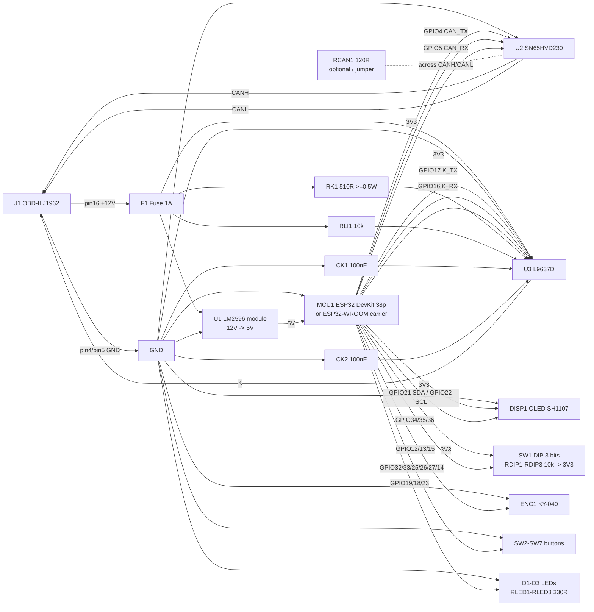

# 15 - Diagrama Eletrico e Handoff PCB

## Objetivo

Este documento e a referencia eletrica consolidada para o engenheiro capturar o esquema da placa de circuito impresso.

Importante:

- neste ambiente nao ha `KiCad`, `EasyEDA` ou `Altium` instalados
- por isso o handoff foi entregue em formato versionavel:
  - `Markdown`
  - `Mermaid`
  - `CSV`

Arquivos complementares:

- [hardware/pcb-handoff/README.md](../hardware/pcb-handoff/README.md)
- [hardware/pcb-handoff/netlist-rev-a.csv](../hardware/pcb-handoff/netlist-rev-a.csv)
- [hardware/pcb-handoff/bom-rev-a.csv](../hardware/pcb-handoff/bom-rev-a.csv)

## Diagrama eletrico funcional

## Mapa de sinais

### Conector OBD-II

| Pino | Sinal | Destino |
|---|---|---|
| `4` | chassis GND | `GND comum` |
| `5` | signal GND | `GND comum` |
| `6` | CANH | `U2 CANH` |
| `7` | K-Line | `U3 K` |
| `14` | CANL | `U2 CANL` |
| `15` | L-Line | `NC` |
| `16` | +12V bateria | `F1`, `U1 IN+`, `U3 VS` |

### CAN

| Origem | Destino |
|---|---|
| `GPIO4` | `U2 TXD` |
| `GPIO5` | `U2 RXD` |
| `U2 CANH` | `OBD pin 6` |
| `U2 CANL` | `OBD pin 14` |

### K-Line

| Origem | Destino |
|---|---|
| `GPIO17` | `U3 pin 4 (TX)` |
| `GPIO16` | `U3 pin 1 (RX)` |
| `U3 pin 6 (K)` | `OBD pin 7` |
| `U3 pin 7 (VS)` | `+12V protegido` |
| `RK1 510R` | `U3 pin 6 -> U3 pin 7` |
| `RLI1 10k` | `U3 pin 8 -> U3 pin 7` |
| `CK1 100nF` | `U3 pin 3 -> U3 pin 5` |
| `CK2 100nF` | `U3 pin 7 -> U3 pin 5` |

## Requisitos de PCB

### Obrigatorios para reproduzir a bancada

- `U2 SN65HVD230`
- `U3 L9637D`
- `RK1 510R >= 0.5W`
- `RLI1 10k`
- `CK1 100nF`
- `CK2 100nF`
- `F1` na entrada `+12V`
- `LM2596` ou buck equivalente

### Recomendados para a revisao da placa

- `RCAN1 120R` configuravel por jumper ou `DNP`
- TVS na entrada `+12V`
- protecao contra inversao de polaridade
- ponto de teste em:
  - `+12V`
  - `+5V`
  - `+3V3`
  - `GND`
  - `CANH`
  - `CANL`
  - `K`
  - `K_TX_LOGIC`
  - `K_RX_LOGIC`

## Observacoes para captura do esquema

### Escolha de implementacao do MCU

O hardware de bancada usa `ESP32 DevKit`. Para a PCB, o engenheiro pode escolher:

1. placa carrier para o `DevKit` existente
2. placa integrada com `ESP32-WROOM-32`

Se escolher a opcao 2, manter o mesmo mapa de GPIOs documentado em [03 - Pinout e Ligacoes](03-pinout.md).

### Escolha de implementacao da fonte

O hardware de bancada usa modulo `LM2596`. Para PCB:

- pode manter footprint/header para modulo buck
- ou redesenhar uma etapa buck equivalente, desde que preserve:
  - entrada `+12V`
  - saida `+5V` para `VIN`
  - corrente suficiente para `ESP32 + OLED + transceivers`

## Matriz de aceite que esta por tras deste esquema

| Barramento | Ferramenta | Resultado |
|---|---|---|
| CAN | `Torque Pro` | OK |
| CAN | `OBDLink MX+` | OK |
| ISO 9141-2 | `OBDLink app` | OK |
| ISO 9141-2 | `Torque Pro` | OK |
| ISO 9141-2 | `YouAutoCar` | OK |
| KWP Fast | `Torque Pro` | OK |

## O que ainda nao esta em arquivo EDA nativo

Ainda falta converter este handoff para:

- `.kicad_sch`, ou
- arquivo nativo de `EasyEDA`

Mas o conteudo tecnico necessario para o engenheiro ja esta fechado neste documento e nos CSVs do pacote `hardware/pcb-handoff/`.
