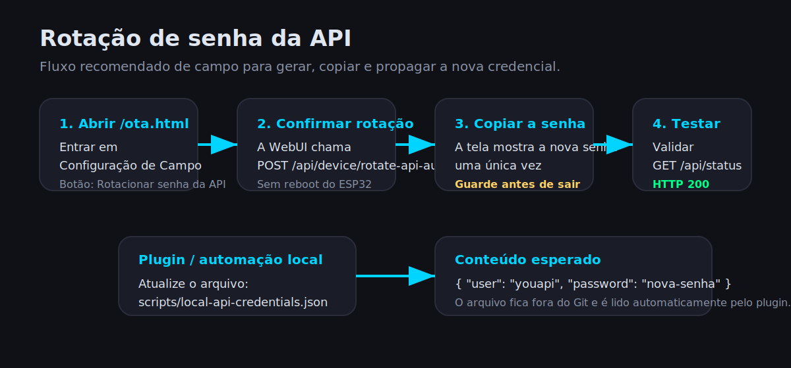

# 19 - Manual de Operação com Imagens

Manual prático para uso diário do `YouSimuladorOBD` em bancada, campo e desenvolvimento com o `YouAutoCarvAPP2`, `Torque Pro`, `OBDLink` e plugin `YOU OBD Lab`.

## 1. Objetivo

Este manual cobre:

- acesso ao painel web
- troca de protocolo
- uso de perfil, modo, cenário e DTC
- OTA online
- gestão de credenciais
- rotação da senha da API
- integração com o plugin local do Codex

## 2. Acesso ao simulador

Acesse pelo hostname mDNS ou pelo IP:

```text
http://youobd2.local/
http://192.168.1.11/
```

Página de administração OTA:

```text
http://youobd2.local/ota.html
http://192.168.1.11/ota.html
```

Credenciais atuais do laboratório:

- Web/OTA: credencial personalizada de operação
- API: credencial dedicada separada da Web

Observação:

- a senha da API pode ser rotacionada sem reboot
- a senha Web/OTA continua no fluxo de salvar configuração e reiniciar

## 3. Painel principal

O painel principal concentra o controle de protocolo, sensores, perfil, modo, cenário e DTCs.

Observação:

- a captura abaixo é ilustrativa
- valores e indicadores podem variar conforme o protocolo, perfil e estado atual do simulador


### O que existe na tela

- seletor de protocolo no topo
- badge do barramento ativo (`CAN` ou `K-Line`)
- sliders de sensores principais
- banco de DTCs e adição manual
- seleção de perfil do veículo
- bloco `Hierarquia Ativa`
- modos de simulação
- camada diagnóstica
- odômetro total e métricas de falha

## 4. Lógica de operação

Use esta ordem para trabalhar de forma previsível:

1. Escolha o protocolo.
2. Aplique o perfil do veículo.
3. Escolha o modo de simulação.
4. Ative o cenário diagnóstico, se necessário.
5. Injete DTCs manuais só quando o teste exigir.

Regra prática:

- `Perfil` define a base do carro.
- `Modo` define a dinâmica.
- `Camada diagnóstica` aplica o overlay de falha.
- `DTC manual` é injeção direta para teste.

## 5. Perfis, modos e cenários

### Perfil do veículo

Use para carregar baseline realista de:

- VIN
- protocolo
- comportamento básico
- parâmetros coerentes por veículo

### Modo de simulação

Os modos mais comuns são:

- `Manual`
- `Marcha Lenta`
- `Urbano`
- `Rodovia`
- `Aquecimento`
- `Falha DTC`

### Camada diagnóstica

Use para falhas compostas, por exemplo:

- superaquecimento
- catalisador
- misfire
- anomalias de sensores

## 6. Página OTA e configuração de campo

Na `/ota.html` ficam:

- informações do dispositivo
- hostname
- manifest OTA padrão
- usuário Web/OTA
- usuário API
- nova senha Web/OTA
- nova senha API
- intervalo de checagem online

Observação:

- a captura abaixo mostra a estrutura da página
- mensagens de status podem variar conforme autenticação, rede e checagem OTA


## 7. Salvar configuração e reiniciar

Use `Salvar configuração e reiniciar` quando você alterar:

- hostname
- manifest OTA
- usuário Web/OTA
- senha Web/OTA
- usuário API
- senha API manualmente
- política de checagem OTA

Esse fluxo:

- grava em NVS
- agenda reboot
- reaplica autenticação e mDNS

## 8. Rotacionar senha da API

Agora existe um botão dedicado:

- `Rotacionar senha da API`

Esse fluxo:

- gera uma senha nova forte
- salva na NVS imediatamente
- não reinicia o ESP32
- mostra a nova senha uma única vez



### Procedimento recomendado

1. Entre em `/ota.html`.
2. Vá em `Configuração de Campo`.
3. Clique em `Rotacionar senha da API`.
4. Copie a nova senha na hora.
5. Atualize scripts, plugin e automações.
6. Teste com `GET /api/status`.

## 9. Plugin YOU OBD Lab

O plugin serve para:

- preparar cenários
- consultar o oracle da API
- abrir o app Android
- coletar logcat
- registrar screenshot
- gerar `report.md` e `report.json`


### Arquivo local de credenciais do plugin

O plugin lê automaticamente:

```text
C:\www\you-obd-lab-plugin\scripts\local-api-credentials.json
```

Formato:

```json
{
  "user": "youapi",
  "password": "sua-senha-forte"
}
```

Esse arquivo:

- fica fora do Git
- deve ser atualizado sempre que a senha da API for rotacionada

## 10. Fluxo recomendado de bancada

### Para validar scanner ou app

1. Escolha o protocolo correto.
2. Aplique o perfil do veículo.
3. Defina o modo.
4. Ative o cenário, se necessário.
5. Conecte `OBDLink` ou `ELM327`.
6. Teste com `YouAutoCarvAPP2`, `Torque Pro` ou `OBDLink`.

### Para validar com o plugin

1. Confirme a senha atual da API.
2. Atualize `local-api-credentials.json` se necessário.
3. Rode o runner de bancada.
4. Compare `API`, `OBD real` e `UI/logcat`.

## 11. OTA online

Fluxo recomendado:

1. Abra `/ota.html`.
2. Confirme o `manifest.json`.
3. Use `Verificar online`.
4. Se houver update, escolha:

- `Baixar firmware`
- `Baixar filesystem`

5. Aguarde a gravação.
6. O ESP32 reinicia automaticamente ao final do OTA.

## 12. Troubleshooting rápido

### Não consigo entrar na web

- confirme IP ou mDNS
- confirme usuário e senha Web/OTA
- se o hostname mudou, use o novo `.local`

### API retorna `401`

- confirme o usuário dedicado da API
- teste em `/api/status`
- se a senha foi rotacionada, atualize o plugin e scripts

### Plugin parou de validar

- revise `local-api-credentials.json`
- teste `GET /api/status`
- execute o runner com `-SkipPhone -SkipAppLaunch` para smoke test rápido

### OTA não baixa

- valide a URL do `manifest.json`
- confirme que o ESP32 tem rede
- use `Verificar online` antes do download

## 13. Referências cruzadas

- [08 - Wi-Fi, Web e OTA](08-wifi-webui.md)
- [09 - Perfis de Veículo](09-vehicle-profiles.md)
- [10 - Simulação Dinâmica](10-dynamic-simulation.md)
- [14 - Cenários Diagnósticos](14-diagnostic-scenarios.md)
- [18 - Plugin Codex YOU OBD Lab](18-codex-plugin-you-obd-lab.md)
