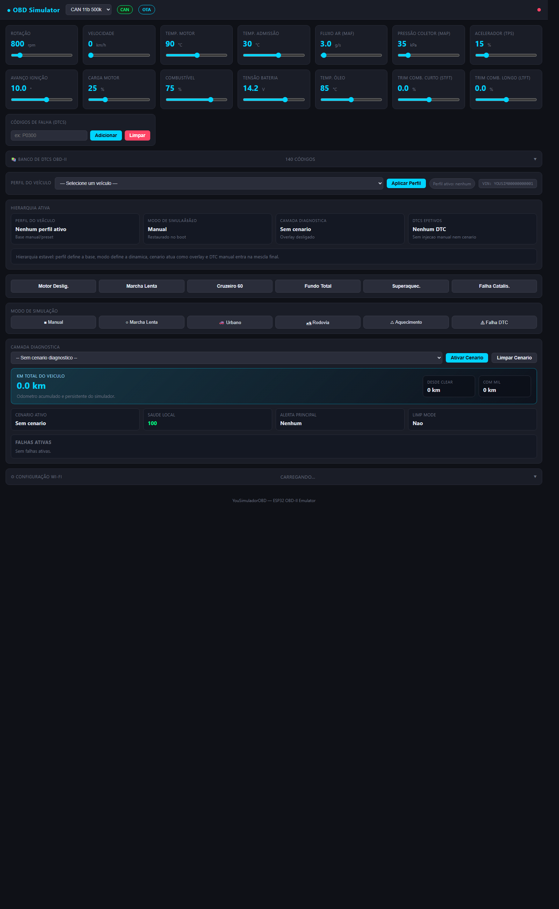
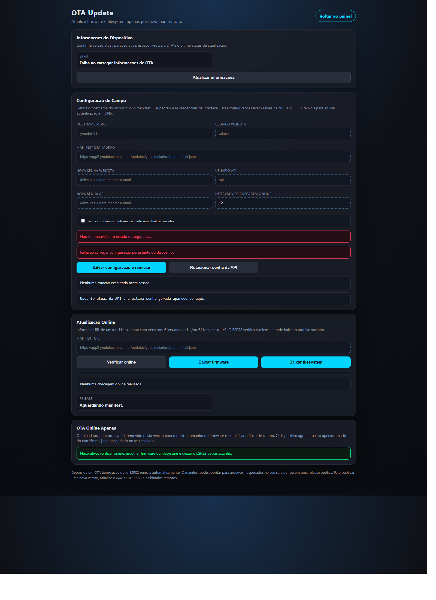
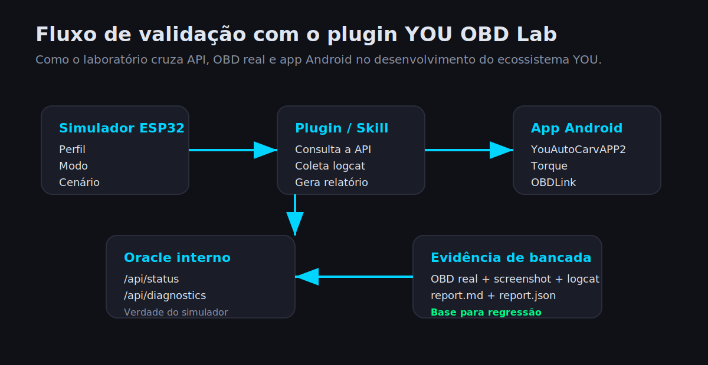

# Manual de Operacao

Manual pratico para uso diario do `YouSimuladorOBD` em bancada, campo e desenvolvimento com `YouAutoCarvAPP2`, `Torque Pro`, `OBDLink` e plugin `YOU OBD Lab`.

## 1. Objetivo

Este manual cobre:

- acesso ao painel web
- troca de protocolo
- uso de perfil, modo, cenario e DTC
- OTA online
- uso da credencial fixa do sistema
- integracao com o plugin local do Codex

## 2. Acesso ao simulador

Acesse pelo hostname mDNS ou pelo IP:

```text
http://youobd2.local/
http://192.168.1.9/
```

Pagina de administracao OTA:

```text
http://youobd2.local/ota.html
http://192.168.1.9/ota.html
```

Credencial atual do laboratorio:

- Web/OTA: credencial fixa de operacao
- API: mesma credencial fixa usada na Web

Observacao:

- hostname e manifest OTA continuam editaveis
- login e senha nao sao alterados pela pagina OTA nesta revisao

## 3. Painel principal

O painel principal concentra o controle de protocolo, sensores, perfil, modo, cenario e DTCs.

Observacao:

- a captura abaixo e ilustrativa
- valores e indicadores podem variar conforme o protocolo, perfil e estado atual do simulador



### O que existe na tela

- seletor de protocolo no topo
- badge do barramento ativo (`CAN` ou `K-Line`)
- sliders de sensores principais
- banco de DTCs e adicao manual
- selecao de perfil do veiculo
- bloco `Hierarquia Ativa`
- modos de simulacao
- camada diagnostica
- odometro total e metricas de falha

## 4. Logica de operacao

Use esta ordem para trabalhar de forma previsivel:

1. Escolha o protocolo.
2. Aplique o perfil do veiculo.
3. Escolha o modo de simulacao.
4. Ative o cenario diagnostico, se necessario.
5. Injete DTCs manuais so quando o teste exigir.

Regra pratica:

- `Perfil` define a base do carro.
- `Modo` define a dinamica.
- `Camada diagnostica` aplica o overlay de falha.
- `DTC manual` e injecao direta para teste.

## 5. Perfis, modos e cenarios

### Perfil do veiculo

Use para carregar baseline realista de:

- VIN
- protocolo
- comportamento basico
- parametros coerentes por veiculo

### Modo de simulacao

Os modos mais comuns sao:

- `Manual`
- `Marcha Lenta`
- `Urbano`
- `Rodovia`
- `Aquecimento`
- `Falha DTC`

### Camada diagnostica

Use para falhas compostas, por exemplo:

- superaquecimento
- catalisador
- misfire
- anomalias de sensores

## 6. Pagina OTA e configuracao de campo

Na `/ota.html` ficam:

- informacoes do dispositivo
- hostname
- manifest OTA padrao
- status da credencial fixa Web/OTA e API
- intervalo de checagem online

Observacao:

- a captura abaixo mostra a estrutura da pagina
- mensagens de status podem variar conforme autenticacao, rede e checagem OTA



## 7. Salvar configuracao e reiniciar

Use `Salvar configuracao e reiniciar` quando voce alterar:

- hostname
- manifest OTA
- politica de checagem OTA

Esse fluxo:

- grava em NVS
- agenda reboot
- reaplica mDNS e demais configuracoes persistentes

## 8. Credencial fixa e plugin

Nesta revisao:

- a credencial do sistema e fixa no firmware
- Web/OTA e API usam o mesmo login
- nao existe rotacao de senha pela UI

## 9. Plugin YOU OBD Lab

O plugin serve para:

- preparar cenarios
- consultar o oracle da API
- abrir o app Android
- coletar logcat
- registrar screenshot
- gerar `report.md` e `report.json`



### Arquivo local de credenciais do plugin

O plugin le automaticamente:

```text
C:\www\you-obd-lab-plugin\scripts\local-api-credentials.json
```

Formato:

```json
{
  "user": "youobd-core",
  "password": "credencial-fixa-da-bancada"
}
```

Esse arquivo:

- fica fora do Git
- deve refletir a credencial fixa vigente do firmware ou da bancada

## 10. Fluxo recomendado de bancada

### Para validar scanner ou app

1. Escolha o protocolo correto.
2. Aplique o perfil do veiculo.
3. Defina o modo.
4. Ative o cenario, se necessario.
5. Conecte `OBDLink` ou `ELM327`.
6. Teste com `YouAutoCarvAPP2`, `Torque Pro` ou `OBDLink`.

### Para validar com o plugin

1. Confirme a credencial fixa vigente no firmware.
2. Atualize `local-api-credentials.json` se necessario.
3. Rode o runner de bancada.
4. Compare `API`, `OBD real` e `UI/logcat`.

## 11. OTA online

Fluxo recomendado:

1. Abra `/ota.html`.
2. Confirme o `manifest.json`.
3. Use `Verificar online`.
4. Se houver update, escolha:

- `Baixar firmware`
- `Baixar filesystem`

5. Aguarde a gravacao.
6. O ESP32 reinicia automaticamente ao final do OTA.

## 12. Troubleshooting rapido

### Nao consigo entrar na web

- confirme IP ou mDNS
- confirme usuario e senha da credencial fixa Web/OTA
- se o hostname mudou, use o novo `.local`

### API retorna `401`

- confirme a credencial fixa Web/API
- teste em `/api/status`
- confirme que plugin e scripts usam a mesma credencial do firmware

### Plugin parou de validar

- revise `local-api-credentials.json`
- teste `GET /api/status`
- execute o runner com `-SkipPhone -SkipAppLaunch` para smoke test rapido

### OTA nao baixa

- valide a URL do `manifest.json`
- confirme que o ESP32 tem rede
- use `Verificar online` antes do download

## 13. Referencias cruzadas

- [Arquitetura canonica](arquitetura.md)
- [Hardware consolidado](hardware.md)
- [Pinout canonico](pinout.md)
- [Firmware - README local](../firmware/README.md)
